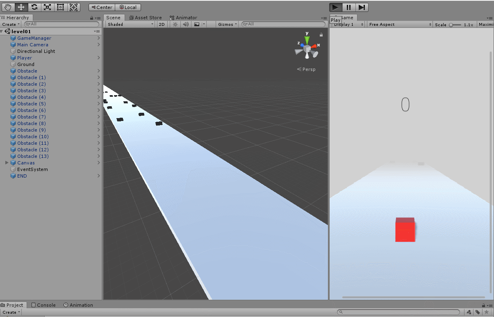

# How-to-make-a-Video-Game-in-Unity

* This project is based on tutorial of Brackeys on Youtube
    * https://www.youtube.com/watch?v=j48LtUkZRjU&list=PLPV2KyIb3jR5QFsefuO2RlAgWEz6EvVi6

 

* Playable demos are in directory Playable/

****

* Purpose: 
    * Learn how ot create a video game in **Unity** Engine.
    * I spilt this tutorial into difference branches to understand steps for different functions.

 

* Version of Unity3D: 
    * ver 2018.4.28f1

 

* Programming Language: 
    * C#
